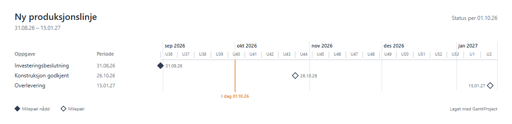
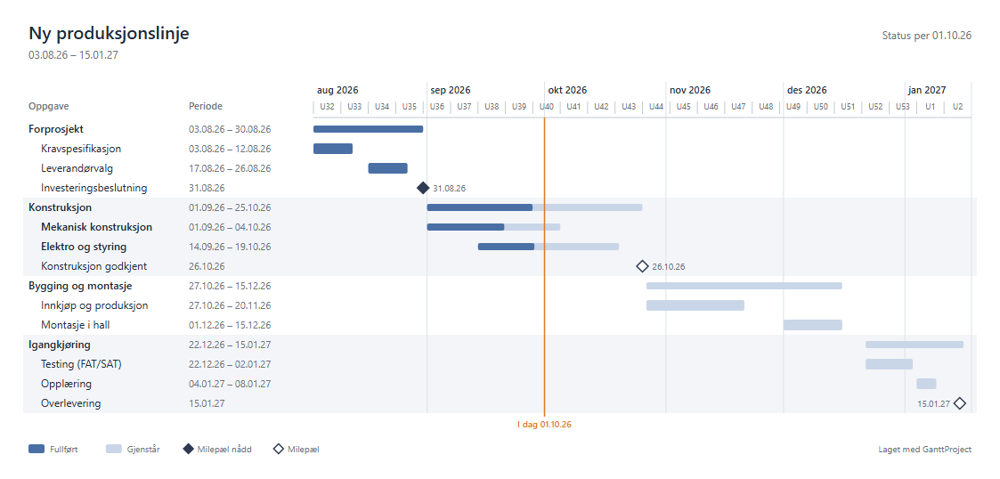
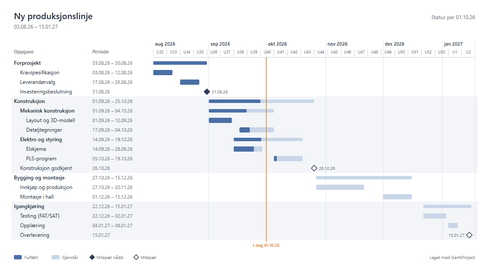
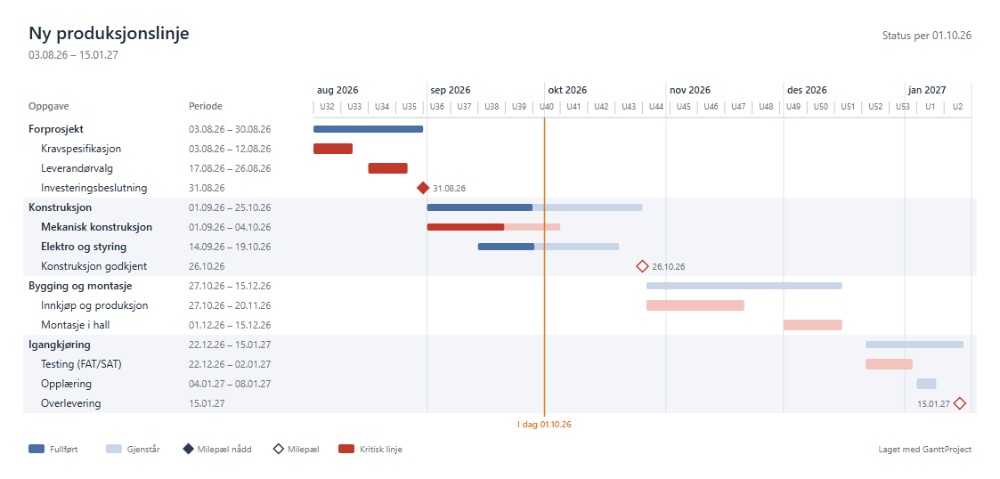

# Oversiktsdiagram

Oversiktsdiagrammet er en enkel rapport på én side. Den viser hva som skal skje og når, uten detaljene fra
arbeidsplanen. Bruk den i statusmøter, i styringsgrupper og når du sender planen til kunder og ledere.

## Lag rapporten

1. Velg **Prosjekt → Eksporter…**. **Oversiktsdiagram** står øverst og er valgt fra før.
2. Velg **Filformat**:
   - **PDF** (standard): for e-post, Teams og utskrift.
   - **SVG**: for PowerPoint og Word.
3. Velg **Detaljnivå** (se under). Bildet under valgene viser hvordan rapporten ser ut.
4. Velg om du vil vise fremdrift og kritisk linje.
5. Klikk **Neste >**, skriv filnavn og klikk den gule eksportknappen.
   Du trenger ikke skrive `.pdf` eller `.svg`. Programmet legger til endelsen.

## Velg riktig detaljnivå

### Bare milepæler – for ledelse og kunde

Viser bare datoene som betyr noe for mottakeren. Bruk den når mottakeren vil vite «når er vi ferdige»,
ikke «hvordan gjør vi det».

### Faser og milepæler – for statusmøter (standard)

Viser de to øverste nivåene i planen og alle milepæler. Dette er standardvalget. Det passer for de fleste
rapporter: mottakeren ser fasene, de viktigste aktivitetene og hvor langt dere har kommet.

### Alle oppgaver – for prosjektgruppen

Viser alle oppgavene i planen. Bruk den når mottakerne selv jobber i prosjektet. Store planer blir lange.
Velg da heller «Faser og milepæler».

### Fremhev kritisk linje

Viser med rødt de oppgavene som flytter sluttdatoen hvis de blir forsinket. Bruk den når dere diskuterer
forsinkelser og tiltak. Planen må ha avhengigheter mellom oppgavene for at den kritiske linjen skal gi mening.

## Slik leser du diagrammet

| Tegn | Betyr |
|---|---|
| Mørk del av stolpen | Fullført andel av oppgaven |
| Lys del av stolpen | Gjenstående arbeid |
| Fylt ruter ◆ | Milepæl som er nådd (100 % fullført) |
| Åpen ruter ◇ | Milepæl som ikke er nådd ennå |
| Oransje linje «I dag» | Dagens dato. Det som ligger til venstre for linjen og ikke er mørkt, er forsinket |
| Rødt | Kritisk linje (bare når valget er slått på) |
| Fet skrift | Oppgaven har underoppgaver (fase eller samleoppgave) |

Grå bånd over hele bredden viser hvilke rader som hører til samme fase.

## Bruk filen

### PDF – send og skriv ut

PDF-en er én liggende A4-side og ser lik ut overalt.

- **Send på e-post eller Teams.** Legg ved PDF-filen. Mottakeren åpner den uten noe spesielt program.
- **Skriv ut.** Åpne PDF-en og trykk `Ctrl+P`. Siden er allerede liggende A4.
- **Store planer.** Planer med svært mange rader får en høyere side, slik at teksten blir lesbar. Velg da
  heller «Faser og milepæler», eller velg **Tilpass** når du skriver ut.

### SVG – sett inn i PowerPoint og Word

SVG er et vektorformat. Bildet blir skarpt i alle størrelser.

- **Sett inn (Microsoft 365).** Velg **Sett inn → Bilder → Denne enheten** og velg SVG-filen. Du kan endre
  størrelsen uten at teksten blir uskarp.
- **Endre i PowerPoint.** Høyreklikk bildet og velg **Konverter til figur** hvis du vil endre tekst eller farger.
- **Se på filen.** Dobbeltklikk. Den åpnes i nettleseren.

### Oppdater rapporten

Rapporten er et øyeblikksbilde. Når planen endres, eksporterer du på nytt med samme filnavn og krysser av for
**Overskriv**.

## Hvorfor ser den slik ut?

Utformingen følger anbefalinger fra fagfolk innen prosjektstyring og visualisering:

- **Få rader for ledere.** PMBOK skiller mellom milepælsplan (for ledelse og kunde) og stolpediagram
  (for prosjektgruppen). Tidslinjevisningen i MS Project anbefaler bare faser og milepæler.
- **Lite rutenett.** Edward Tufte anbefaler å fjerne rutenettet slik at oppgavene står i fokus. Diagrammet
  har bare svake linjer ved hver måned eller hvert år.
- **Få farger med fast betydning.** Stephen Few anbefaler å bruke farge bare når fargen betyr noe.
- **Navn og datoer ved siden av stolpene, alt på én liggende side** (think-cell, Tufte).
- **Ingen avhengighetspiler.** De hører hjemme i den detaljerte planen, ikke i en oversikt.
